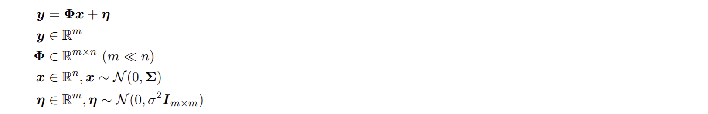
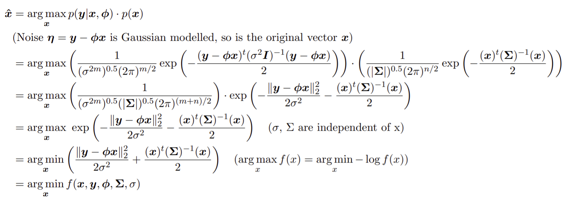
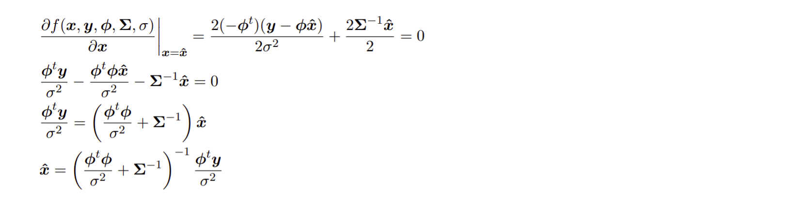
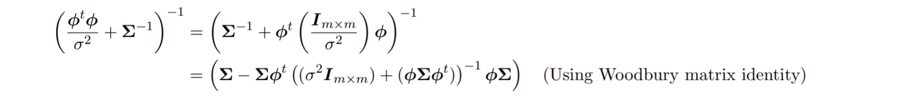
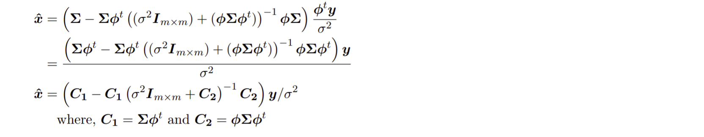
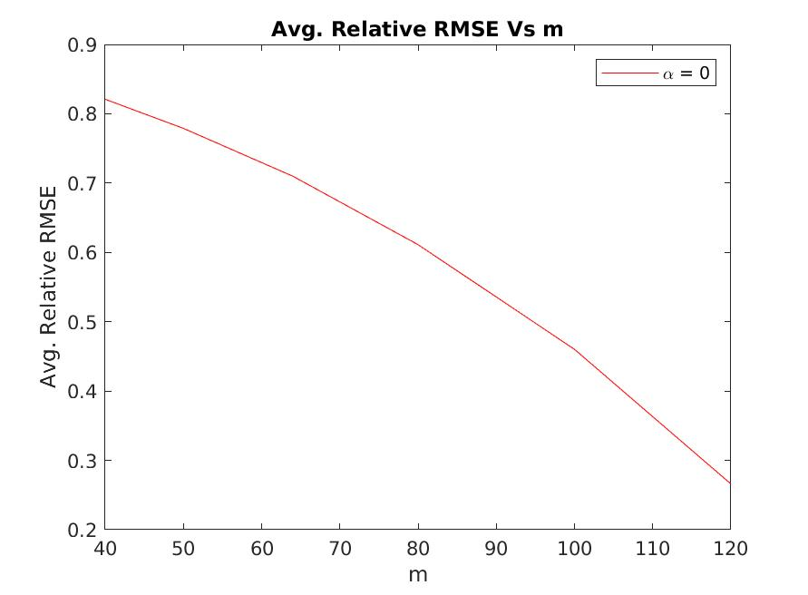
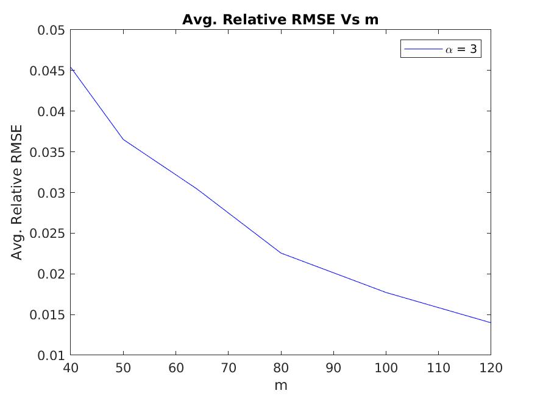
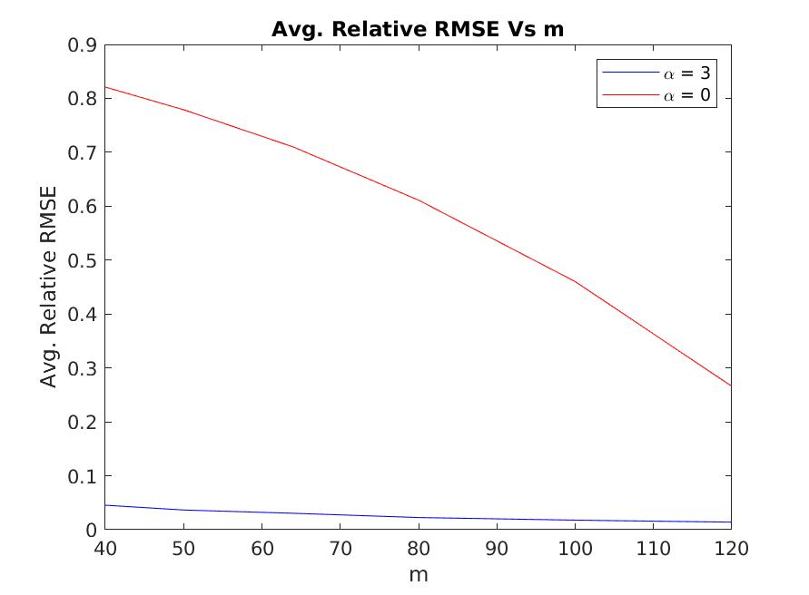

# Statistical Compressed Sensing

Implemented Compressed Sensing based on Bayesian Statistics.

## Given

## MAP Estimate

We find the maximum a posteriori (MAP) estimate of **x** given **Φ**, **y**, **Σ**

First, we use Bayes' theorem  

Taking derivative to find closed form of MAP estimate  

Optimizing the inverse computation using Woodbury matrix Identity  

Final closed form of MAP estimate  

## Generating the Covariance Matrix (Σ)

Assumption: **i**th eigenvalue of the covariance matrix is of the form: **i**-**α** for all **i**s.

1. Choose a random orthonormal matrix **U** of size **n**x**n**.
2. Define a diagonal matrix **D** of size **n**x**n** with diagonal entries as **i**-**α**.
3. Covariance Matrix, **Σ** is defined as **UDU'**.

## Experiment

We experiment with two values of **α**: 0, 3.  
For each **α**, we generate **nexp** **n**-dimensional vectors (**x**s).

We choose a set of **m**.  
For every **m**, we generate a random sensing matrix **Φ** of size **m**x**n** with entries from iid Gaussian with mean 0 and variance 1/**m**.

We use this to generate measure signal **y** (**Φ** **x**).  
We add Gaussian noise with standard deviation as 0.01 times average of measured signal.

We reconstruct **x** using the MAP estimate formula derived above and compute Relative Root Mean Square Error (Relative RMSE).

## Code

Code for Experiments is present in form of a function in `main.m`

Execute `main.m` in MATLAB to reproduce the results. You can adjust the parameters like dimension of **x** (**n**), number of experiments (**nexp**) and set of **m** to test in `main.m`.  
The code is tested on MATLAB 2020b, but should work on other versions of MATLAB with no or little changes.

## Results

   

  

## Conclusions

- Average Relative RMSE decreases with increase in m as expected. We have more information about the original signal, so reconstruction is better.
- Average Relative RMSE for **α** = 3 lies in range 0.01-0.05. As the eigenvalues decay very fast (cubic speed), so elements are zero (or almost zero) with high probability. This means that the signal x is sparse (hence, compressible) , thus giving better reconstruction.
- Average Relative RMSE for **α** = 0 lies in range 0.25-0.85. As the eigenvalues don’t decay, so elements aren't zero (or almost zero) with high probability. This means that the signal x is not sparse (hence, not compressible), thus giving poorer reconstruction.
- Average Relative RMSE for any m is higher for smaller **α** (decay factor)
- The decay of the eigenvalues of the covariance matrix is the equivalent of signal sparsity or compressibility in an appropriate orthonormal basis.
